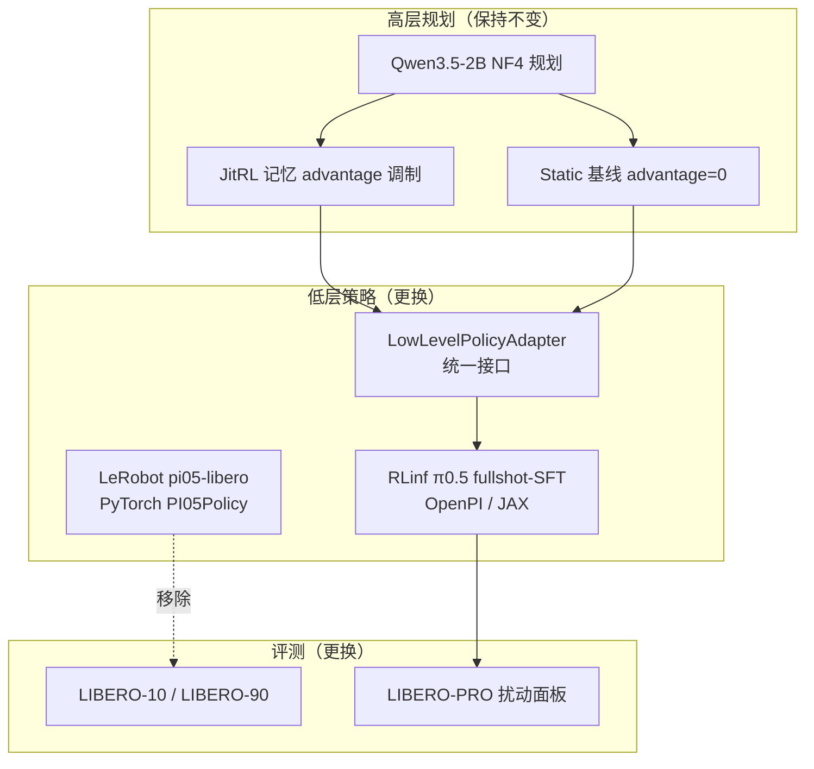

# 迁移计划：RLinf π0.5 (LIBERO-130 fullshot SFT) + LIBERO-PRO 评测面板

## 1. 目标与范围

将当前 JitPi05 评测套件的两个组件同时替换，并在新套件上重做 JitRL × HarnessVLA 消融：

| 组件 | 现状 | 目标 |
| --- | --- | --- |
| 低层策略 | `lerobot/pi05-libero`（LeRobot PyTorch） | `RLinf/RLinf-Pi05-LIBERO-130-fullshot-SFT`（OpenPI/Flax NNX） |
| 评测数据 | LIBERO-10 / LIBERO-90 | LIBERO-PRO（五维扰动 robustness） |
| 消融框架 | jitrl-free / static-free / jitrl / static 四格 | 保持不变 |

实验性质从「记忆调制是否有增益」转为「泛化 robustness 下的记忆调制行为」。

## 2. 关键事实

- RLinf checkpoint 是 OpenPI（Flax NNX/JAX）格式，不能直接被 LeRobot `PI05Policy.from_pretrained` 加载。
- 本项目当前纯 PyTorch（torch 2.11/cu130 + LeRobot 0.6），无 JAX/Flax/openpi 依赖。
- RLinf/OpenPI 的 π0.5 在 LIBERO 上**省略 proprioceptive state 输入**，且图像需旋转 180° 对齐训练预处理；`action_chunk=5`、`num_steps=10`、`action_env_dim=7`。
- 当前 rollout 深度依赖 LeRobot 接口：`policy.predict_action_chunk(batch, noise)`、`policy.config.chunk_size`、`policy.config.max_action_dim`、`policy.reset()`，并复用同一 flow noise 保证四方法低层轨迹可比。
- LIBERO-PRO 通过替换 libero 库 `benchmark/__init__.py` 与 `libero_suite_task_map.py`，并写入 bddl/init 文件注册新 suite（`libero_10_object/swap/lan/task/env` 等）。

## 3. 架构迁移图

## 4. 分阶段步骤

### Phase 0：环境与资源准备

1. 评估 JAX 与 PyTorch cu130 共存（`XLA_PYTHON_CLIENT_MEM_FRACTION`、`JAX_PLATFORMS=cuda`），决定 in-process JAX 或独立加载进程。
2. `git clone` OpenPI / RLinf 依赖，`uv` 或独立 venv 安装；不破坏现有 LeRobot 环境。
3. 下载 `RLinf/RLinf-Pi05-LIBERO-130-fullshot-SFT`，用 `pi05_libero` config 加载并单步 `infer` 验证。
4. 下载 `zhouxueyang/LIBERO-Pro` 的 bddl/init 文件。

### Phase 1：低层策略 adapter

5. 实现 `LowLevelPolicyAdapter`，暴露现有 rollout 所需接口：
   - `reset()` / `config.chunk_size` / `config.max_action_dim`
   - `predict_action_chunk(frame, noise)`：内部完成 OpenPI 输入组装 + `infer` + 反归一化，返回 7 维 action chunk。
6. 输入对齐：双相机 180° 旋转、省略 state、归一化 stats 取自 RLinf 训练统计。
7. noise 对齐：确认 OpenPI infer 是否接受显式初始噪声；若不接受，改为固定全局 seed 使四方法共享同一低层随机性。
8. 单任务单 episode 冒烟测试，核对 action chunk 形状与数值范围。

### Phase 2：LIBERO-PRO 面板

9. 注册 LIBERO-PRO suite（替换 libero benchmark 两文件，或项目内新增 suite 解析），确保原始 libero10/libero90 面板不受影响。
10. `config.py` 新增 `JITPI05_JITRL_PANEL=libero_pro`：定义扰动维度 suite 名、任务描述、max_steps 映射（libero_10→520 等）。
11. 冒烟测试：LIBERO-PRO 单任务环境可建、`task_description` 正确、init state 可加载。

### Phase 3：消融配置与完整评测

12. 确定评测矩阵：扰动维度 × 四方法 × 每任务 episode 数（建议沿用 10–50 episodes/方法）。
13. 运行完整评测，生成 summary.json（沿用现有 metrics 统计管线）。

### Phase 4：结论写回

14. 研判结果，写回 `reports/ablation/` 下的泛化 robustness 消融报告。

## 5. 风险与决策点

| 风险 | 说明 | 应对 |
| --- | --- | --- |
| JAX/PyTorch CUDA 显存冲突 | Qwen NF4 与 JAX π0.5 同驻 | 评估独立进程方案；`XLA_PYTHON_CLIENT_MEM_FRACTION` |
| noise 注入接口缺失 | OpenPI infer 不暴露显式噪声 | 固定全局 seed 保持公平比较 |
| 输入格式漂移 | state 省略 + 图像旋转 | adapter 内统一对齐，冒烟验证 |
| libero 库全局改动 | 替换 benchmark 文件影响原面板 | 项目内注册，避免全局覆盖 |
| 成功率显著下降 | π0.5 在 LIBERO-PRO 仅 ~0.53 | 预期内，报告需区分扰动维度 |
