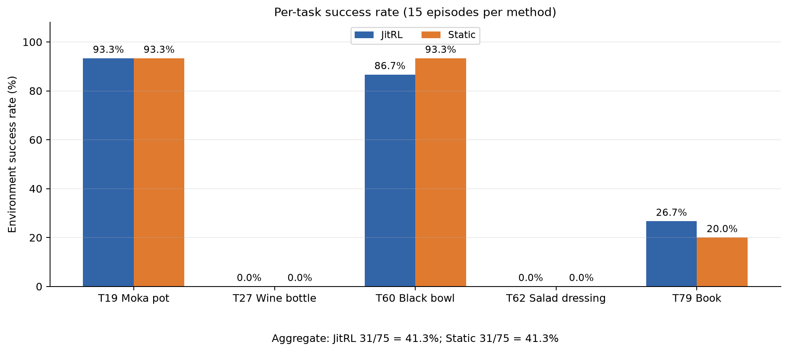
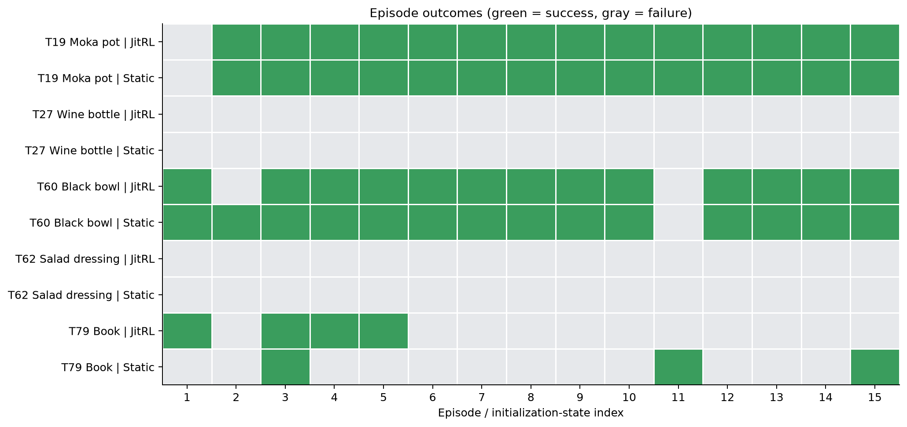
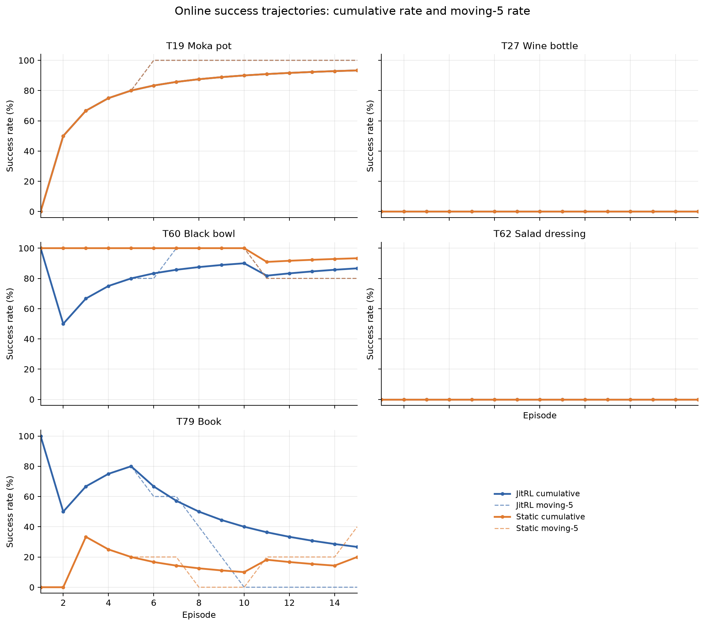
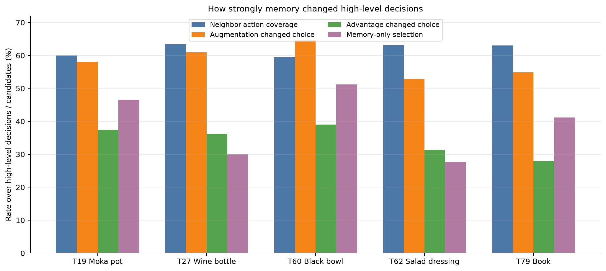
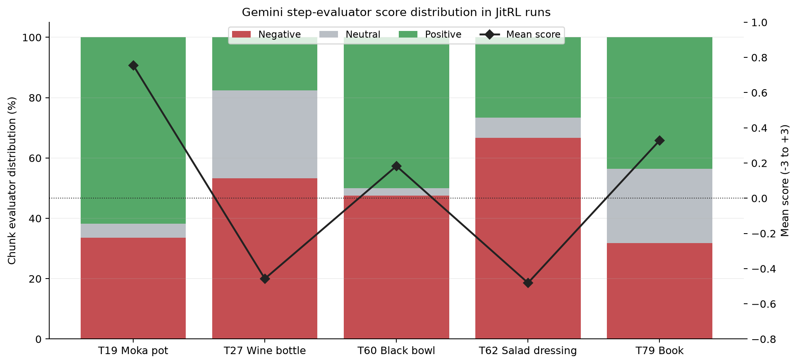
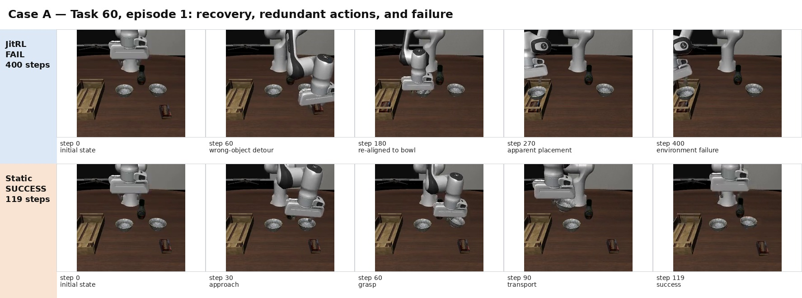
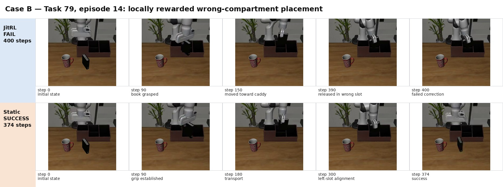
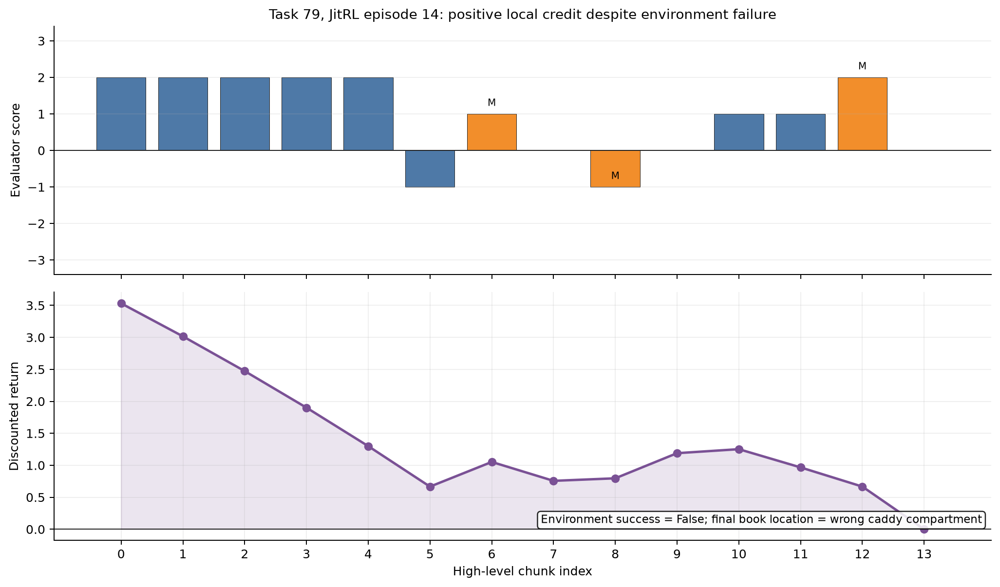
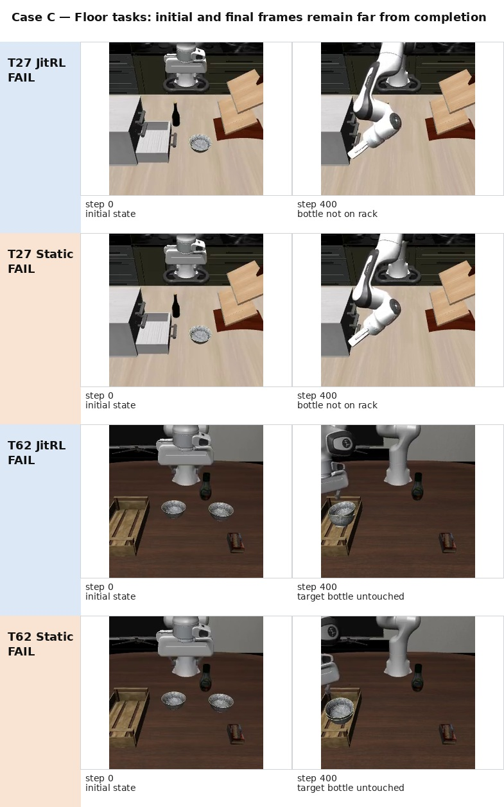

# JitRL 在分层 VLM–VLA 机器人控制中的多任务实验报告

> 实验目录：[`artifacts/jitrl_eval_libero90_5tasks_seed17_qwen4b_beta040`](../artifacts/jitrl_eval_libero90_5tasks_seed17_qwen4b_beta040/)  
> 实验规模：5 个 LIBERO-90 任务 × 2 种方法 × 15 个 episode × 1 个 seed，共 150 条 rollout  
> 报告生成日期：2026-07-28

---

## 摘要

本实验研究 JitRL 式无梯度测试时记忆能否改善分层 VLM–VLA 机器人控制。系统以 Gemini 3.6 Flash 完成双相机视觉理解、状态摘要、高层候选生成及逐高层 chunk 评价；以本地 4-bit Qwen3.5-4B 提供五个候选编号的显式 logits；以 JitRL memory 检索历史状态—动作—回报记录、补充历史候选并使用 advantage 调制候选 logits；最终由冻结的 LeRobot π₀.₅ 将选中的高层文本 subtask 映射为连续机器人动作。环境成功仍完全由 LIBERO 内部任务谓词判定。

实验在 LIBERO-90 task 19、27、60、62、79 上分别运行 JitRL 与 Static 各 15 个 episode。总结果为：

- **JitRL：31/75，41.3%**；
- **Static：31/75，41.3%**；
- 总成功率差值：**0 个百分点**；
- 相同初始化状态上的不一致成功配对为 JitRL-only 3 个、Static-only 3 个，精确 McNemar 双侧检验为 `p=1.0`；
- 5 个任务上的描述性 macro 差值为 0，task bootstrap 区间约为 `[-4, +4]` 个百分点。

尽管总体成功率持平，memory 确实显著改变了高层策略：各任务约 52.9%–64.6% 的高层决策因历史候选增广而改变基础选择，约 27.9%–39.0% 的高层决策又因 advantage 更新而改变最终选择，memory-only action 的实际选择率为 27.6%–51.2%。因此，本轮结果不是“记忆没有介入”，而是“记忆强烈介入，但尚未带来总体环境成功率收益”。

任务表现呈现明显分层：task 19 和 task 60 接近高成功率上限，task 27 和 task 62 为双方法全败，task 79 位于中间难度。代表性轨迹进一步表明，当前主要问题包括：高层 memory 诱发重复或回退动作、逐步视觉奖励可对错误目标位置给出较高局部 credit，以及低层 VLA 在细长物体抓取、窄目标放置和稳定释放方面存在明显能力上限。

---

## 1. 研究问题

本实验关注以下三个问题：

1. **可运行性**：论文式 JitRL memory、检索、UCB、augmented candidate 和 additive logit update 能否在冻结的 VLM–VLA 机器人闭环中稳定工作？
2. **行为影响**：记忆是否真正改变候选集合、候选概率和最终高层动作？
3. **任务收益**：这些高层策略变化是否能提高 LIBERO 环境成功率，或缩短成功轨迹？

本实验不对模型参数做梯度更新。所有适应均来自 episode 之间累积的外部非参数 memory。

---

## 2. 实验系统

### 2.1 模型分工

| 模块 | 模型或实现 | 作用 |
|---|---|---|
| 视觉状态理解 | Gemini 3.6 Flash | 读取外部相机和腕部相机图像，输出结构化状态摘要 |
| 高层候选生成 | Gemini 3.6 Flash | 每次生成 5 个自由文本 subtask 及 `semantic_key` |
| 显式候选 logits | Qwen3.5-4B，NF4 4-bit | 对候选编号 `1..5` 计算下一 token logits |
| 测试时记忆 | JitRL memory | Jaccard top-k 检索、V/Q/A、随机 UCB、历史候选补充 |
| 低层动作 | `lerobot/pi05-libero` | 将“总体任务 + 当前 subtask”映射为连续动作 chunk |
| 逐步评价 | Gemini 3.6 Flash | 根据动作前后双相机图像生成 `-3..+3` 局部分数 |
| 最终成功判定 | LIBERO/MuJoCo | 根据环境内部任务谓词输出二值成功标记 |

核心实验配置位于 [`settings.py`](../settings.py)，在线闭环位于 [`jitrl_eval.py`](../jitrl_eval.py)，多任务入口和汇总位于 [`eval_jitrl.py`](../eval_jitrl.py)。

### 2.2 决策时间尺度

- 每个 episode 最多 400 个环境步；
- π₀.₅ 每 10 个环境步重新预测一次低层 action chunk；
- Gemini/Qwen 高层规划每 30 个环境步更新一次；
- 一个高层 subtask 默认控制连续 3 个低层 action chunk；
- 满 400 步的 episode 最多产生 14 个高层决策。

### 2.3 Memory 与 logit 更新

每条经验记录为：

\[
(s_t, a_t, G_t)
\]

其中，`s_t` 为 Gemini 状态摘要，`a_t` 为自由文本 subtask 及规范化语义键，`G_t` 为从逐步奖励计算的 discounted return。

对当前状态检索 top-10 邻居后，使用：

\[
V(s)=\frac{1}{|N(s)|}\sum_{i\in N(s)}G_i
\]

\[
Q(s,a)=\frac{1}{|N(s,a)|}\sum_{i\in N(s,a)}G_i
\]

\[
A(s,a)=Q(s,a)-V(s)
\]

未在邻居中出现的动作按照随机 UCB 规则处理，参数为 `λ=0.05`、`α=5.0`。候选集合为 Gemini 当前五个候选与检索到的去重历史动作并集；Gemini 候选的 Qwen logits 先减去均值，memory-only action 的 base logit 为 0。

归一化 advantage 后执行：

\[
z'(s,a)=z(s,a)+\beta\tilde A(s,a)
\]

本轮使用 `β=0.40`、temperature `0.8`。

### 2.4 逐步奖励

Gemini evaluator 在 episode 结束后读取每个高层 chunk 的动作前后双相机关键帧，输出 `-3..+3` 分数：

\[
r_t=\frac{score_t}{3}
\]

若环境成功，最后一个 chunk 额外增加 `+1`，随后使用 `γ=0.95` 计算：

\[
G_t=r_t+\gamma G_{t+1}
\]

JitRL memory 在 episode 内只读，episode 完成并评价后才批量写入；每个任务的 JitRL run 从独立空 memory 冷启动。Static 不读取或写入 memory，advantage 恒为 0。

---

## 3. 测评任务与实验规模

### 3.1 LIBERO-90 任务

| Task ID | 环境语言任务 | 操纵对象 | 目标结构 |
|---:|---|---|---|
| 19 | `put the moka pot on the stove` | moka pot | stove |
| 27 | `put the wine bottle on the wine rack` | wine bottle | wine rack |
| 60 | `pick up the black bowl on the left and put it in the tray` | black bowl | wooden tray |
| 62 | `pick up the salad dressing and put it in the tray` | salad dressing bottle | wooden tray |
| 79 | `pick up the book and place it in the left compartment of the caddy` | book | caddy 左侧 compartment |

每个 task/method run 使用 seed 17，依次运行 `init_state_id=0..14`。实验总量为：

\[
5\ \text{tasks}\times 2\ \text{methods}\times 15\ \text{episodes}=150\ \text{rollouts}
\]

正式总汇总见 [`summary.json`](../artifacts/jitrl_eval_libero90_5tasks_seed17_qwen4b_beta040/summary.json)。

### 3.2 统计口径

报告使用以下指标：

- overall success rate；
- 前 5 个与后 10 个 episode 成功率；
- 成功 episode 的平均完成步数；
- 相同初始化状态上的四格配对结果；
- memory 候选覆盖、候选增广改选率、advantage 改选率、memory-only 选择率；
- evaluator 正分、零分、负分比例及平均分。

由于每个 task/method 只有一个 seed，且同一 JitRL run 中 episode 通过在线 memory 顺序相关，本报告将置信区间和配对检验视为描述性统计，不据此做跨 seed 或整个 LIBERO-90 suite 的总体推断。

---

## 4. 总体结果

### 4.1 各任务成功率



**图 1：** 每个任务上 JitRL 与 Static 的环境成功率。两种方法总成功数均为 31/75。

| 任务 | JitRL | Static | JitRL − Static |
|---|---:|---:|---:|
| task 19 | 14/15，93.3% | 14/15，93.3% | 0.0 pp |
| task 27 | 0/15，0.0% | 0/15，0.0% | 0.0 pp |
| task 60 | 13/15，86.7% | 14/15，93.3% | −6.7 pp |
| task 62 | 0/15，0.0% | 0/15，0.0% | 0.0 pp |
| task 79 | 4/15，26.7% | 3/15，20.0% | +6.7 pp |
| **合计** | **31/75，41.3%** | **31/75，41.3%** | **0.0 pp** |

任务级差值恰好互相抵消：task 60 为 −6.7 个百分点，task 79 为 +6.7 个百分点，其余三个任务为 0。5 任务 macro 差值为 0，描述性 task bootstrap 区间约为 `[-4, +4]` 个百分点。

全部 75 个相同初始化状态中：

- 两种方法同时成功：28 个；
- 仅 JitRL 成功：3 个；
- 仅 Static 成功：3 个；
- 两种方法同时失败：41 个；
- 精确 McNemar 双侧检验：`p=1.0`。

### 4.2 Episode 级成功分布



**图 2：** 每个任务、方法和初始化状态的成功矩阵。绿色为环境成功，灰色为失败。

图 2 显示任务结果具有明显的 ceiling/floor 结构：

- task 19 与 task 60 大部分初始化状态都能完成；
- task 27 与 task 62 在全部 60 条 rollout 中没有出现一次成功；
- task 79 才表现出明显的中等难度和方法间差异。

这意味着本轮总体成功率主要由任务自身难度分层决定：容易任务中高层策略变化通常不会破坏成功，困难任务中高层策略变化又难以突破低层执行上限。

### 4.3 在线时序



**图 3：** 各任务累计成功率与 moving-5 成功率。实线为累计成功率，虚线为最近 5 个 episode 成功率。

主要时序现象如下：

- task 19：两种方法成功序列完全一致，均为 `011111111111111`；
- task 60：JitRL 仅在 episode 1 额外失败，随后两种方法基本一致；
- task 27、task 62：全程保持 0；
- task 79：JitRL 前 5 个 episode 成功 4 次，后 10 个 episode 成功 0 次；Static 前 5 个成功 1 次，后 10 个成功 2 次。

Task 79 的具体序列为：

```text
JitRL : 101110000000000
Static: 001000000010001
```

因此，task 79 的 overall success rate 虽然是 JitRL 26.7% 对 Static 20.0%，但其增益全部来自前 5 个 episode；memory 增长后并未维持这一表现。5 个任务的 final-10 macro success rate 为 JitRL 38%、Static 42%，差值为 −4 个百分点。

### 4.4 成功轨迹效率

成功 episode 的平均步数如下：

| 任务 | JitRL | Static | JitRL − Static |
|---|---:|---:|---:|
| task 19 | 236.1 | 241.9 | −5.8 |
| task 60 | 113.8 | 116.9 | −3.2 |
| task 79 | 352.0 | 302.0 | +50.0 |

Task 19 与 task 60 中，JitRL 的成功轨迹平均略短；但差值不足 6 步，相对于最长 400 步的 episode 很小。Task 79 中 JitRL 的成功轨迹反而平均多用 50 步。所有成功样本汇总后，JitRL 平均约 199.8 步，Static 平均约 191.3 步；该 pooled 数值同时受到各任务成功样本组成影响，主要用于描述，不应解释成严格的策略效率估计。

---

## 5. Memory 是否真正改变了高层行为



**图 4：** JitRL memory 对高层候选和动作选择的影响。各指标均按任务分别统计。

| 任务 | 邻居动作覆盖 | 增广导致改选 | Advantage 导致改选 | Memory-only 被选中 | 平均绝对 logit shift |
|---|---:|---:|---:|---:|---:|
| task 19 | 60.0% | 58.0% | 37.4% | 46.6% | 0.206 |
| task 27 | 63.5% | 61.0% | 36.2% | 30.0% | 0.205 |
| task 60 | 59.5% | 64.6% | 39.0% | 51.2% | 0.231 |
| task 62 | 63.1% | 52.9% | 31.4% | 27.6% | 0.224 |
| task 79 | 63.1% | 54.9% | 27.9% | 41.2% | 0.174 |

此外，各任务 95.4%–97.9% 的 augmented candidates 具有非零归一化 advantage。最终 memory 大小分别为：

- task 19：131；
- task 27：210；
- task 60：82；
- task 62：210；
- task 79：204。

Memory 大小与成功率并非正相关。其原因之一是失败 episode 通常运行满 400 步并生成 14 条高层经验，而成功 episode 会提前结束；因此 task 27、task 62 等全败任务反而拥有最大的 memory。

上述结果证明：

1. Memory 检索并非空转，约 60% 的候选能在邻居中找到动作支持；
2. 候选增广是影响最大的机制，超过半数高层决策的基础选择被改变；
3. `β=0.40` 下，advantage update 也会改变约三分之一的最终选择；
4. 历史 action 不只是进入候选，约三至五成高层决策最终执行了 memory-only action；
5. 强策略干预并未自动带来更高环境成功率。

因此，本轮失败不能归因于“调制力度不足”。更关键的问题是被检索经验的物理相关性、逐步 credit 与最终任务谓词的一致性，以及低层策略能否可靠执行所选 subtask。

---

## 6. 逐步评价与奖励分布



**图 5：** JitRL run 中 Gemini evaluator 的 chunk 分数分布。柱状图分别表示负分、零分和正分比例，黑色折线为平均原始分数。

| 任务 | 负分 | 零分 | 正分 | 平均原始分数 |
|---|---:|---:|---:|---:|
| task 19 | 33.6% | 4.6% | 61.8% | +0.756 |
| task 27 | 53.3% | 29.0% | 17.6% | −0.457 |
| task 60 | 47.6% | 2.4% | 50.0% | +0.183 |
| task 62 | 66.7% | 6.7% | 26.7% | −0.481 |
| task 79 | 31.9% | 24.5% | 43.6% | +0.328 |

总体趋势与任务难度基本一致：task 19 的正分比例最高；task 27、task 62 的平均分为负；task 60 和 task 79 同时包含大量局部进展和局部回退。

但局部分数并不等同于任务完成。Evaluator 擅长识别“接近、抓取、移动、下降、释放”等局部视觉变化，却不总能可靠判断：

- 被操纵的是否为正确对象；
- 对象是否进入正确目标区域；
- 对象是否位于正确 compartment；
- 放置后是否满足 LIBERO 内部稳定关系；
- 后续动作是否破坏了此前的有效放置。

这种局部—终局差异在后文两个案例中表现得最清楚。

---

## 7. 代表性案例分析

### 7.1 案例 A：task 60 episode 1——错误对象绕行、恢复与重复操作



**图 6：** 同一 task 60 初始化状态下的 JitRL 与 Static。Static 在 119 步成功，JitRL 运行满 400 步失败。

对应正式视频：

- [JitRL episode 1](../artifacts/jitrl_eval_libero90_5tasks_seed17_qwen4b_beta040/libero_90_task60/jitrl/seed_17/videos/episode_1.mp4)
- [Static episode 1](../artifacts/jitrl_eval_libero90_5tasks_seed17_qwen4b_beta040/libero_90_task60/static/seed_17/videos/episode_1.mp4)

JitRL 轨迹中的关键步骤为：

| Chunk | 动作来源 | 高层动作摘要 | Evaluator score | 现象 |
|---:|---|---|---:|---|
| 0 | generator | 向左侧碗下降 | −2 | 实际对准了错误的右侧碗 |
| 1 | memory | 对齐目标碗 | −2 | 抓住了无关的 pudding box |
| 3 | generator | 再次向黑碗下降 | −2 | 仍持有错误物体并移动到 tray 上方 |
| 5 | generator | 向右移动到左侧黑碗 | +2 | 成功恢复到目标碗附近 |
| 6 | generator | 抓取左侧黑碗 | +2 | 成功抓取并抬起目标碗 |
| 8 | generator | 将碗放入 wooden crate/tray | +2 | 视觉上出现稳定释放 |
| 10–13 | memory/generator | 再次接近、对齐并抓取碗 | −1/+1/+2/−2 | 在看似完成后继续重复操作，最终耗尽 400 步 |

Static 则沿着接近—抓取—搬运—放置路径，在 119 步触发环境成功。

这个案例体现了三个问题：

1. **错误对象 grounding 会产生长程代价。** JitRL 最初两个 chunk 因空间和对象识别错误而抓取无关物体，花费约 180 步才恢复到目标碗；
2. **局部恢复不等于高效完成。** 虽然后续成功抓取和搬运，但轨迹已显著变长；
3. **缺少可靠的完成阶段保持。** 在 evaluator 认为放置和撤离均为正进展后，memory 又重新提出接近和抓取动作，导致策略从“可能完成”状态回退。

该案例的完整 chunk 表见 [`case_libero_90_task60_episode_1_chunks.csv`](tables/case_libero_90_task60_episode_1_chunks.csv)。

### 7.2 案例 B：task 79 episode 14——错误槽位被赋予正局部回报



**图 7：** 同一 task 79 初始化状态下，JitRL 将书放入错误 compartment 并失败；Static 在 374 步完成左槽放置。

对应正式视频：

- [JitRL episode 14](../artifacts/jitrl_eval_libero90_5tasks_seed17_qwen4b_beta040/libero_90_task79/jitrl/seed_17/videos/episode_14.mp4)
- [Static episode 14](../artifacts/jitrl_eval_libero90_5tasks_seed17_qwen4b_beta040/libero_90_task79/static/seed_17/videos/episode_14.mp4)

JitRL 前五个 chunk 连续获得 `+2`：

1. 接近书本；
2. 对齐夹爪；
3. 抓住书本；
4. 抬升书本；
5. 向 caddy 左侧移动。

后续轨迹将书释放到 caddy 中，但实际槽位不满足环境要求；chunk 12 的 memory-only `release|item|caddy` 仍获得 `+2`。最终环境成功为 False。



**图 8：** Task 79 JitRL episode 14 的 evaluator score 与 discounted return。橙色柱表示 memory-only action，`M` 为标记。尽管最终任务失败，大部分 chunk 的 return 仍为正。

该 episode 中：

- 14 个高层 chunk 中有 9 个获得正分；
- 前五个 chunk 均获得 `+2`；
- memory-only 释放动作获得 `+2`；
- 最终环境失败；
- 失败前的 return 仍大范围保持为正。

当前奖励仅在成功时给最后一个 chunk 增加 `+1`，失败时没有对称 terminal penalty。因此，只要轨迹完成了抓取、搬运、下降和释放等局部动作，即使对象进入错误槽位，早期状态—动作对仍可能得到较高 return。Memory 随后会把这些经验作为正价值行为重新检索。

该案例说明，机器人任务中的 credit assignment 需要更强的目标谓词约束。仅凭局部视觉进展，很容易把“进入 caddy”误当成“进入 caddy 左侧 compartment”。

完整 chunk 表见 [`case_libero_90_task79_episode_14_chunks.csv`](tables/case_libero_90_task79_episode_14_chunks.csv)。

### 7.3 案例 C：task 27 与 task 62——低层策略能力下限



**图 9：** Task 27 与 task 62 的 episode 14 初始帧和末帧。两种方法均运行满 400 步且没有完成任务。

Task 27 要求将细长 wine bottle 放到 wine rack。JitRL episode 14 中出现：

- 初始阶段移动到错误区域；
- 搬运过程中掉落酒瓶；
- 随后移动到与 rack 相反的方向；
- 最终没有持有目标物，也没有完成放置。

对应 [JitRL 视频](../artifacts/jitrl_eval_libero90_5tasks_seed17_qwen4b_beta040/libero_90_task27/jitrl/seed_17/videos/episode_14.mp4) 与 [Static 视频](../artifacts/jitrl_eval_libero90_5tasks_seed17_qwen4b_beta040/libero_90_task27/static/seed_17/videos/episode_14.mp4)。

Task 62 要求抓取 salad dressing bottle 并放入 tray。JitRL episode 14 中，策略一度接近目标瓶，但随后：

- 把 patterned bowl 误认为目标物；
- memory-only 动作使机械臂移向 tray 而不是目标瓶；
- 末帧中目标 salad dressing 仍直立在原位。

对应 [JitRL 视频](../artifacts/jitrl_eval_libero90_5tasks_seed17_qwen4b_beta040/libero_90_task62/jitrl/seed_17/videos/episode_14.mp4) 与 [Static 视频](../artifacts/jitrl_eval_libero90_5tasks_seed17_qwen4b_beta040/libero_90_task62/static/seed_17/videos/episode_14.mp4)。

这两个任务中，JitRL 和 Static 共 60 条 rollout 全部失败，说明系统缺少稳定的可成功执行通道。高层即使提出正确的 grasp、transport、align、place 指令，低层 π₀.₅ 仍可能因对象几何、干扰物、抓取姿态或目标结构而无法完成动作。

---

## 8. 逐任务研判

### 8.1 Task 19：接近成功率上限

- JitRL 与 Static 均为 14/15；
- 两者成功序列完全一致；
- 后 10 个 episode 均为 10/10；
- JitRL 成功平均步数比 Static 少约 5.8 步；
- JitRL evaluator 平均分为五个任务中最高的 `+0.756`。

该任务对低层策略较友好。Memory 会显著改变动作，但环境结果已接近饱和，额外策略改进难以反映在二值成功率上。

### 8.2 Task 27：酒瓶与酒架构成执行 floor

- 两种方法均为 0/15；
- 所有 episode 均运行满 400 步；
- JitRL evaluator 负分率 53.3%，平均分 −0.457；
- 最终 memory 达 210 条，但未出现成功经验。

由于 memory 中全部 episode 都失败，系统主要积累局部接近、抓取、掉落、重试和错误放置记录。即使其中某些 chunk 获得局部正分，也缺少完整成功轨迹来提供可靠终局信用。

### 8.3 Task 60：Static 略优，但 JitRL 大部分状态仍成功

- JitRL 13/15，Static 14/15；
- 仅 episode 1 为 Static-only success；
- JitRL 成功平均步数略短 3.2 步；
- memory-only 选择率达到五个任务最高的 51.2%；
- candidate augmentation 改选率达到 64.6%。

Task 60 表明，在低层策略本来就较强的任务上，memory 引入了很高的行为多样性，但净收益接近 0；代表性失败由错误对象绕行和完成后的重复操作造成。

### 8.4 Task 62：对象 grounding 与抓取执行共同失败

- 两种方法均为 0/15；
- evaluator 负分率达到五个任务最高的 66.7%；
- 平均分为 −0.481；
- memory-only 选择率为 27.6%，但没有产生成功轨迹。

视频和 trace 均显示策略容易把相邻碗、tray 或其他中央物体当成当前目标，且无法稳定抓取细长 salad dressing bottle。

### 8.5 Task 79：总体略高，但后期成功率下降

- JitRL 4/15，Static 3/15；
- JitRL 前 5 个 episode 为 4/5，后 10 个为 0/10；
- Static 前 5 个为 1/5，后 10 个为 2/10；
- JitRL 成功平均步数比 Static 多 50 步；
- memory-only 选择率 41.2%；
- 最终 memory 为 204 条。

Task 79 是本轮最有诊断价值的任务。系统已能完成抓取、抬升和 caddy 附近放置，但对左/中/右 compartment 的精确区分、稳定释放和完成后停止仍不可靠。局部 reward 对“放进 caddy 但槽位错误”的行为给予正 credit，是后续 memory 质量的重要风险。

---

## 9. 主要发现

### 9.1 JitRL 已成功接入机器人闭环

从工程角度，本实验验证了以下链路可以在冻结模型条件下稳定运行 150 条 rollout：

```text
双相机观测
→ Gemini 状态摘要与五候选
→ Qwen3.5-4B 显式候选 logits
→ task-local JitRL memory 检索
→ augmented candidate + V/Q/A + UCB
→ additive logit update
→ π₀.₅ 连续动作执行
→ Gemini 逐 chunk 评价
→ discounted return
→ episode 后写入 memory
```

10 条 run 均完整结束，未出现 memory 跨任务污染或 artifact 覆盖。

### 9.2 行为变化强，但环境收益为零

Memory 使高层策略发生了大幅变化：候选增广改选率超过 50%，advantage 改选率约 28%–39%。但总体成功率完全持平。这表明“改变语言动作分布”与“改善机器人任务成功率”之间仍隔着视觉 grounding、物理执行和终局 credit 三个关键接口。

### 9.3 任务难度决定了指标灵敏度

两个任务接近高成功率上限，两个任务处于全败下限。只有 task 79 位于中间区域。对机器人策略学习而言，过易任务无法显示改进，过难任务又无法提供成功经验；成功率位于中间区间的任务更适合研究测试时记忆。

### 9.4 局部视觉进展可能与终局谓词不一致

抓取、搬运、下降和释放都可以获得正分，但最终对象可能位于错误目标区域。Task 79 episode 14 和 task 60 episode 1 均说明，逐步 evaluator 需要更明确地绑定正确对象、正确目标和最终稳定关系。

### 9.5 低层 VLA 是部分任务的绝对上限

Task 27 和 task 62 中，两种高层方法均无法获得任何成功。细长物体抓取、运输过程中保持夹持、窄结构对准和稳定放置是主要难点。若低层策略没有可重复的成功概率，高层 memory 无法单独突破这一能力下限。

---

## 10. 结论

本轮实验不能支持“JitRL 提高了 VLM–VLA 机器人控制总体成功率”的结论。最直接的结果是：

\[
\text{JitRL}=31/75=41.3\%,\qquad
\text{Static}=31/75=41.3\%
\]

但实验同样不能简单归纳为“JitRL 没有作用”。内部 trace 明确显示 memory 在高频改变候选集合、候选价值和最终高层动作。当前更准确的结论是：

> **JitRL 能够在无梯度条件下显著改变分层机器人策略的高层动作分布，但在当前逐步奖励、经验表示与低层 VLA 能力条件下，这种行为变化尚未转化为多任务环境成功率提升。**

本轮最具研究价值的发现不是总体成功率，而是三个具体接口问题：

1. **经验质量**：失败轨迹中的局部正进展可形成高 return 经验；
2. **任务完成保持**：策略可能在看似完成后重新抓取或回退；
3. **执行可达性**：部分对象和目标结构超出当前 π₀.₅ 的稳定执行范围。
