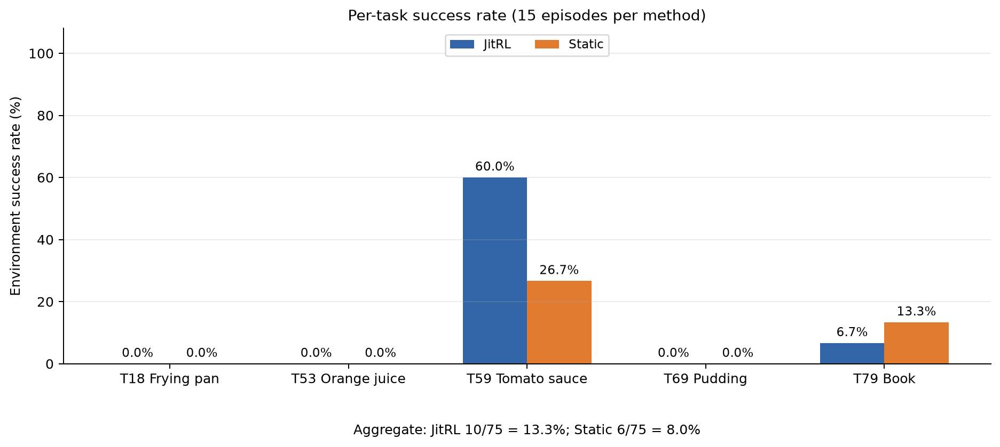
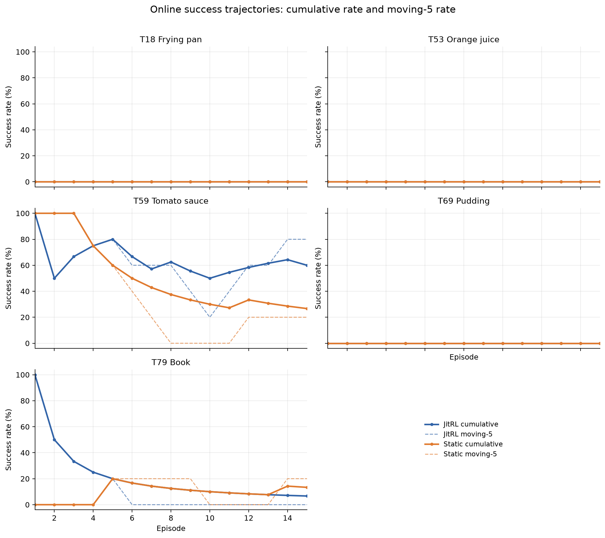
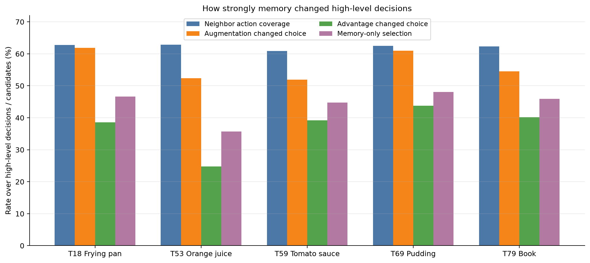
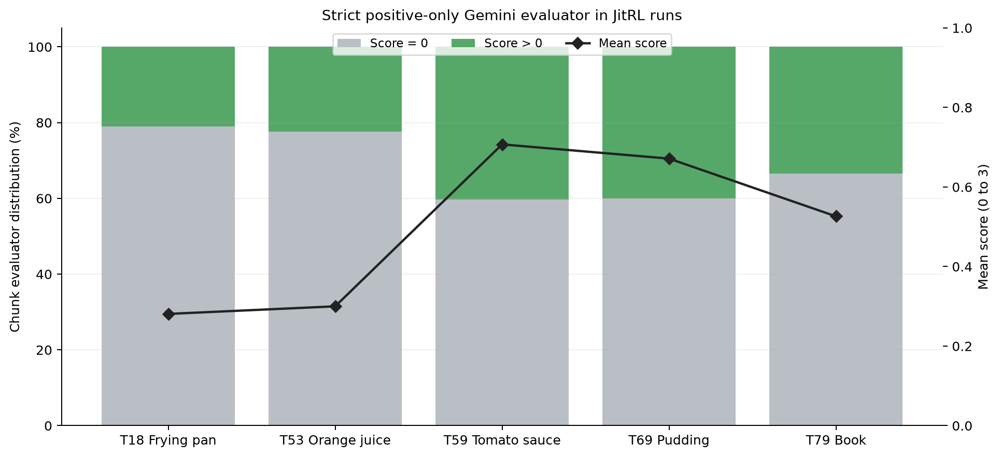
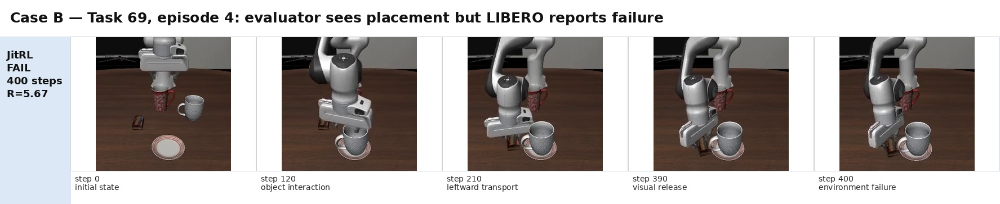
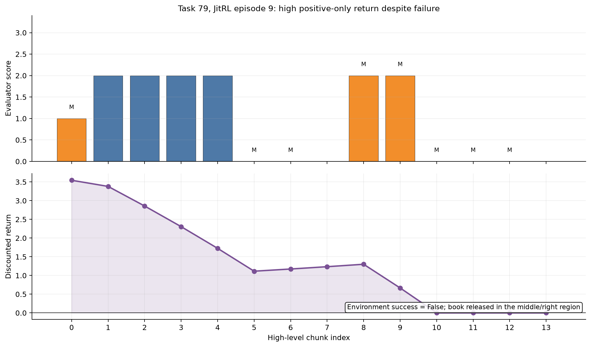
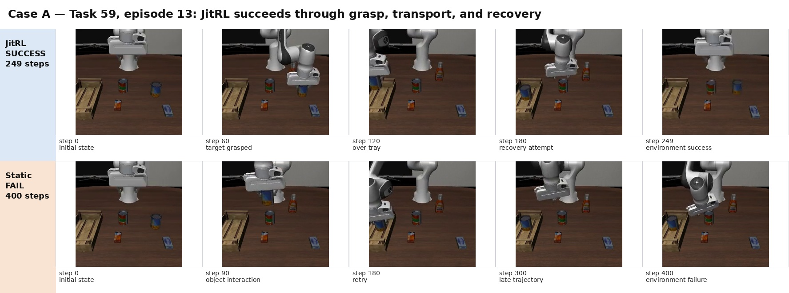
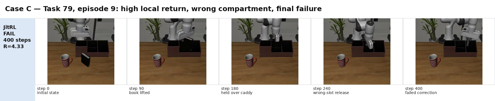

# JitRL 在分层 VLM–VLA 机器人控制中的严格正奖励-only 实验报告

> 实验目录：[`artifacts/jitrl_eval_libero90_mid5_seed17_qwen4b_positive_v3`](../artifacts/jitrl_eval_libero90_mid5_seed17_qwen4b_positive_v3/)
> 
> 实验规模：5 个 LIBERO-90 任务 × 2 种方法 × 15 个 episode × 1 个 seed，共 150 条 rollout
> 
> 主要模型：Gemini 3.6 Flash、Qwen3.5-4B NF4、`lerobot/pi05-libero`
> 
> 报告生成日期：2026-07-30
> 
> 本报告对应的图表与数据位于 [`figures/`](figures/) 和 [`tables/`](tables/)。上一轮 signed-reward 实验报告仍保留在 [`signed_reward/report.md`](../signed_reward/report.md)。

---

## 摘要

本轮实验研究 JitRL 式无梯度、测试时外部记忆是否能够改善分层 VLM–VLA 机器人控制。相比上一轮，本轮做了两项改变：

1. 将任务面板更换为 LIBERO-90 task 18、53、59、69、79，减少已知过易或过难任务的影响；
2. 将 Gemini chunk evaluator 改为**严格正奖励-only**：只允许输出 `score ∈ {0,1,2,3}`；明确有益进展给 1–3 分，错误对象、错误目标、错误 compartment、回退、重复、无效果和视觉不确定统一给 0 分；成功 episode 的最后一个 chunk 仍额外加 1。

系统以 Gemini 3.6 Flash 读取双相机观测，生成状态摘要和五个高层候选；本地 Qwen3.5-4B 只对候选编号计算显式 logits；JitRL memory 检索 task-local 历史经验，加入 memory-only 候选并通过 advantage 调制 logits；冻结的 π₀.₅ 执行选定的高层 subtask；episode 结束后再由 Gemini 评价每个高层 chunk，并将 discounted return 写回 memory。

主要结果如下：

- **JitRL：10/75 = 13.3%**；
- **Static：6/75 = 8.0%**；
- 总体绝对提升 **+5.3 个百分点**，相对提升约 **+66.7%**；
- 净提升完全由 task 59 的 `9/15 vs 4/15` 贡献，task 79 反而为 `1/15 vs 2/15`；
- task 18、53、69 两种方法均为 0/15；
- 75 个相同初始化状态中，JitRL-only 成功 7 次，Static-only 成功 3 次，共同成功 3 次，共同失败 62 次；精确 McNemar 双侧检验为 `p=0.34375`。

因此，本轮提供了一个**任务集中、探索性的弱阳性信号**：JitRL 在 tomato sauce → tray 任务上明显改善了成功覆盖，但尚不能据此声称在多任务 LIBERO 控制上稳定优于 Static。机制指标显示 memory 的确强烈介入；真正的瓶颈是局部正奖励与终局成功谓词不一致、失败轨迹仍产生高 return，以及低层 π₀.₅ 对对象 grounding 和精确放置的执行上限。

---

## 1. 研究问题与实验假设

本轮围绕以下问题展开：

1. **任务面板替换后，JitRL 是否能在中等难度任务上产生可重复的成功率提升？**
2. **严格 positive-only evaluator 是否能在不使用负奖励的情况下提供足够的 credit 分辨率？**
3. **memory 检索、候选增广与 advantage logit update 是否真正改变高层动作？**
4. **高层局部 reward 的变化能否传递到 LIBERO 的最终二值成功？**

核心假设是：正奖励-only 可以避免视觉 evaluator 对动作进行错误负向惩罚，同时保留对清晰进展的信用；但它也可能使失败轨迹中的局部进展保留较高 return，从而污染后续 memory。

本实验不对 Qwen、Gemini 或 π₀.₅ 做梯度更新。所有在线适应仅来自 episode 之间的非参数、task-local memory。

---

## 2. 系统与算法配置

### 2.1 模型分工

| 模块 | 模型或实现 | 作用 |
|---|---|---|
| 视觉状态理解 | Gemini 3.6 Flash | 读取外部相机和腕部相机图像，输出结构化状态摘要 |
| 高层候选生成 | Gemini 3.6 Flash | 每次生成 5 个自由文本 subtask 和 `semantic_key` |
| 候选编号 logits | Qwen3.5-4B，NF4 4-bit | 对候选编号 `1..5` 计算下一 token logits，不生成复杂 JSON |
| 测试时记忆 | JitRL memory | Jaccard top-k 检索、V/Q/A、随机 UCB、历史候选补充 |
| 低层动作 | `lerobot/pi05-libero` | 将总体任务和当前 subtask 映射为连续动作 chunk |
| 逐步评价 | Gemini 3.6 Flash | 根据每个 chunk 前后的双相机图像输出 0–3 分 |
| 最终成功判定 | LIBERO/MuJoCo | 根据环境内部任务谓词输出二值成功标记 |

实现位置包括 [`config.py`](../../src/jitpi05/config.py)、[`rollout.py`](../../src/jitpi05/jitrl/rollout.py)、[`planner.py`](../../src/jitpi05/jitrl/planner.py)、[`vlm.py`](../../src/jitpi05/jitrl/vlm.py) 和 [`metrics.py`](../../src/jitpi05/jitrl/metrics.py)。

### 2.2 时间尺度

- 每个 episode 最多 400 个环境步；
- π₀.₅ 每 10 个环境步重新预测一次低层 action chunk；
- Gemini/Qwen 每 30 个环境步重新规划一次高层动作；
- 一个高层 subtask 默认连续控制 3 个低层 action chunk；
- 满 400 步的 episode 最多包含 14 个高层决策。

### 2.3 JitRL memory 与 logits 调制

每条经验记录为：

$$
(s_t,a_t,G_t)
$$

其中 `s_t` 为 Gemini 状态摘要，`a_t` 为高层文本动作及规范化语义键，`G_t` 为 discounted return。

对当前状态检索 top-10 邻居，使用：

$$
V(s)=\frac{1}{|N(s)|}\sum_{i\in N(s)}G_i
$$

$$
Q(s,a)=\frac{1}{|N(s,a)|}\sum_{i\in N(s,a)}G_i
$$

$$
A(s,a)=Q(s,a)-V(s)
$$

候选集合为 Gemini 当前五个候选和去重历史动作的并集。未见过的动作使用随机 UCB 分支，参数为 `λ=0.05`、`α=5.0`。归一化 advantage 后执行：

$$
z'(s,a)=z(s,a)+\beta\tilde A(s,a)
$$

本轮参数为：

```text
Qwen model             Qwen/Qwen3.5-4B
seed                   17
episodes per run       15
high-level period      30 environment steps
low-level period       10 environment steps
beta                   0.40
temperature            0.8
gamma                  0.95
UCB exploration rate   0.05
UCB alpha              5.0
terminal success bonus +1.0
```

### 2.4 严格 positive-only evaluator

本轮的 evaluator schema 要求：

```text
score ∈ {0, 1, 2, 3}
usefulness = "useful"  iff score > 0
usefulness = "neutral" iff score == 0
```

正分只表示视觉上清晰、与总体任务相关的进展：

- `1`：轻微但明确的有益进展；
- `2`：重要的中间进展，例如正确抓取、正确运输或接近目标；
- `3`：非常显著的进展或接近完成；
- `0`：错误对象、错误目标、错误 receptacle/region/compartment、回退、重复、无效果、释放不明确或视觉不确定。

chunk reward 为：

$$
r_t=\frac{score_t}{3}
$$

成功 episode 的最后一个 chunk 额外增加 `+1`；失败 episode 不加入 terminal negative penalty；之后使用 `γ=0.95` 计算 discounted returns。实现见 [`_evaluate_episode_chunks()`](../../src/jitpi05/jitrl/rollout.py)。

需要强调：**evaluator reward 非负，不代表 JitRL advantage 非负。** 当某候选的 `Q(s,a)<V(s)` 时，仍有 `A(s,a)<0`，因此该动作的 logit 仍会被压低。

---

## 3. 任务面板与实验规模

### 3.1 LIBERO-90 任务

| Task ID | 语言任务 | 主要对象 | 目标结构 | 结果定位 |
|---:|---|---|---|---|
| 18 | `put the frying pan on the stove` | frying pan | stove | grounding / execution floor |
| 53 | `pick up the orange juice and put it in the basket` | orange juice | basket | 包装物辨识与抓取 floor |
| 59 | `pick up the tomato sauce and put it in the tray` | tomato sauce | tray | 本轮唯一中等成功任务 |
| 69 | `put the chocolate pudding to the left of the plate` | chocolate pudding | plate 左侧空间关系 | evaluator–environment mismatch |
| 79 | `pick up the book and place it in the left compartment of the caddy` | book | caddy 左 compartment | 精确槽位放置 |

每个 task/method 使用 seed 17 和 15 个固定初始化状态，实验总量为：

$$
5\ \text{tasks}\times2\ \text{methods}\times15\ \text{episodes}=150\ \text{rollouts}
$$

正式汇总见 [`summary.json`](../artifacts/jitrl_eval_libero90_mid5_seed17_qwen4b_positive_v3/summary.json)。

### 3.2 运行完整性

| 检查项 | 结果 |
|---|---:|
| run summary 文件 | 10 |
| episodes 文件 | 10 |
| metrics 文件 | 10 |
| failure 文件 | 0 |
| episode 数 | 150 |
| 任务级独立 memory | 是 |
| 旧实验目录是否被覆盖 | 否 |

每个 task 的 JitRL 和 Static 都从独立 run 目录启动；JitRL 每个 task 使用独立空 memory。Static 不读取、不写入 memory，advantage 恒为 0。

### 3.3 统计边界

每个 task/method 只有一个 seed，因此 seed-level bootstrap 区间退化为单个观测值，不能支持跨 seed 推断。同一 JitRL run 中 episode 又通过在线 memory 顺序依赖，不能把 15 个 episode 当成 15 个独立同分布样本。本报告中的汇总和检验均为探索性、描述性结果。

此外，这 5 个 task 是有目的地筛选的任务面板，不是 LIBERO-90 的随机样本，因此 task macro 不能直接解释为 suite-wide generalization。

---

## 4. 总体结果

### 4.1 成功率



**图 1：** 五个任务上的 JitRL 和 Static 环境成功率。

| 任务 | JitRL | Static | JitRL − Static |
|---|---:|---:|---:|
| task 18 | 0/15，0.0% | 0/15，0.0% | 0.0 pp |
| task 53 | 0/15，0.0% | 0/15，0.0% | 0.0 pp |
| task 59 | **9/15，60.0%** | **4/15，26.7%** | **+33.3 pp** |
| task 69 | 0/15，0.0% | 0/15，0.0% | 0.0 pp |
| task 79 | 1/15，6.7% | 2/15，13.3% | −6.7 pp |
| **合计** | **10/75，13.3%** | **6/75，8.0%** | **+5.3 pp** |

总结果的表面提升完全由 task 59 的 5 个额外成功贡献；task 79 损失 1 个成功，另外三个任务没有区分度。因此，本轮不能概括为“所有任务均获得提升”，而应表述为：

> JitRL 在 tomato sauce → tray 任务上出现明显正向结果，但在其余任务上没有形成普遍收益。

### 4.2 配对结果

75 个相同初始化状态上的配对结果为：

- 两种方法均成功：3 个；
- 仅 JitRL 成功：7 个；
- 仅 Static 成功：3 个；
- 两种方法均失败：62 个；
- 精确 McNemar 双侧检验：`p=0.34375`。

任务 59 的配对结构最有信息量：JitRL-only 6 个、Static-only 1 个、共同成功 3 个、共同失败 5 个，task-level 精确 McNemar `p=0.125`。在单 seed、每任务 15 个 episode 的条件下，这仍然只是可复现性待验证的探索性证据。

### 4.3 在线时序



**图 2：** 各 task 的累计成功率和 moving-5 成功率。

关键成功序列为：

```text
task 18 JitRL : 000000000000000
task 53 JitRL : 000000000000000
task 59 JitRL : 101110010011110
task 69 JitRL : 000000000000000
task 79 JitRL : 100000000000000

task 59 Static: 111000000001000
task 79 Static: 000010000000010
```

Task 59 中 JitRL 前 5 个 episode 成功 `4/5`，后 10 个成功 `5/10`；Static 前 5 个 `3/5`，后 10 个仅 `1/10`。这支持 JitRL 至少在该任务中形成了某种跨 episode 的纠错或重用能力，但后期仍不稳定。

Task 79 的 JitRL 在 episode 0 成功后，后 14 个全部失败；因此 memory 增长没有把成功经验稳定保持下来，反而可能检索到局部正确但终局错误的操作。

### 4.4 成功轨迹效率

| 汇总 | JitRL | Static |
|---|---:|---:|
| 成功 episode 数 | 10 | 6 |
| 成功 episode 平均步数 | 315.0 | 298.7 |
| task 59 成功平均步数 | 308.9 | 265.5 |
| task 79 成功平均步数 | 370.0 | 365.0 |

JitRL 的成功覆盖增加，但成功轨迹整体更长，说明本轮收益主要体现为**提高部分轨迹最终完成的概率**，而不是缩短完成路径。Task 59 中 JitRL 多次通过恢复或重试完成任务，因此成功率上升伴随执行效率下降。

---

## 5. Memory 是否真正改变了行为



**图 3：** memory 检索、候选增广与 advantage 调制对高层决策的影响。

全任务 JitRL 汇总指标：

| 指标 | 数值 |
|---|---:|
| 邻居动作覆盖率 | 62.3% |
| 非零 advantage 比例 | 97.1% |
| Advantage 导致最终 choice change | 37.3% |
| 候选增广导致基础 choice change | 56.3% |
| memory-only candidate 比例 | 60.4% |
| memory-only action 实际选择率 | 44.2% |
| UCB 触发率 | 1.63% |
| 平均绝对 logit shift | 0.209 |
| 平均检索邻居数 | 9.34 / 10 |
| JitRL 最终 memory 大小均值 | 204 条 |

因此，JitRL 并不是“memory 没有介入”。在 beta=0.40 下，候选增广和 advantage 更新都显著改变了高层动作分布；UCB 触发率仅 1.63%，不是主要驱动因素。

但是，行为介入并不等价于行为质量提升。被选中的 generator action 平均 evaluator score 为 0.513，memory action 为 0.463；对应正分率分别为 32.7% 和 29.3%。这只是描述性比较，受到状态和任务分布混杂影响，但不支持“memory-only action 普遍更好”的判断。

此外，全部选中 chunk 中：

- selected advantage 为负的 chunk：642/1020；
- selected advantage 为零的 chunk：70/1020；
- selected advantage 为正的 chunk：308/1020。

这并不违反算法定义：更新后仍使用与 base distribution 相同的 CDF 随机数采样，最终被选动作不必是 advantage 最大的动作。它说明当前系统的调制更像是**改变采样分布**，而不是执行 advantage-greedy 选择。

---

## 6. Positive-only reward 的分布与有效性



**图 4：** 严格 positive-only evaluator 的 0 分/正分分布与平均原始 score。

本轮共有 75 个 JitRL episode、1020 个高层 chunk：

- 0 分 chunk：约 **68.6%**；
- 正分 chunk：约 **31.4%**；
- 负分 chunk：**0%**；
- 平均原始 score：**0.497**；
- 成功 episode 平均总局部 reward：**4.40**；
- 失败 episode 平均总局部 reward：**2.05**。

奖励仍有一定判别力：成功轨迹平均 reward 约为失败轨迹的 2.15 倍，episode 级成功与总 reward 的点二列相关约为 0.566。但失败轨迹获得较高正 reward 的现象非常明显，尤其集中在 task 69 和 task 79。

### 6.1 Task 69：高局部 reward 但全部失败

Task 69 的环境成功率为 0/15，但 JitRL evaluator 平均 score 为 0.671，正分率约 40.0%。其前 5 个 episode 平均 score 为 0.729，后 10 个仍为 0.643，说明 memory 没有改善环境成功，却持续获得较高局部 credit。

代表性 episode 4：

- 最终环境成功：False；
- 运行满 400 步；
- 总局部 reward：**5.667**；
- 初始 discounted return：**3.883**；
- evaluator 认为机器人完成了接近、抓取、向 plate 左侧搬运和释放；
- LIBERO 最终 predicate 仍未满足。



**图 5：** 视觉 evaluator 认为出现放置进展，但环境最终判定失败。该案例说明当前 evaluator 的“左侧附近/释放”判断还没有严格绑定 LIBERO 的空间关系和稳定放置谓词。

### 6.2 Task 79：错误 compartment 仍产生高 return

代表性 episode 9：

- 最终环境成功：False；
- 运行满 400 步；
- 总局部 reward：**4.333**；
- 初始 discounted return：**3.545**；
- 前 5 个 chunk 依次获得接近、抓取、抬升、移动和下降的正分；
- 书最终落入 caddy 的错误区域；
- 后续重新抓取和纠正没有成功。



**图 6：** episode 9 的局部 score 和 discounted return。即使最终失败，前半段 return 仍保持较高正值，这些经验会进入 memory。

这正是严格 positive-only 的核心 trade-off：错误动作本身被置零，但只要失败轨迹包含足够多的局部进展，整条轨迹早期的 return 仍可能很高。当前实现没有失败 terminal penalty，因此不能自动把“接近但错误终局”的经验从成功经验中区分出来。

---

## 7. 代表性轨迹分析

### 7.1 Case A：Task 59 episode 13——memory 帮助形成成功动作链



**图 7：** JitRL 在 task 59 episode 13 中 249 步完成 tomato sauce → tray。

该 episode 的 chunk 序列包括：

| Chunk | 来源 | 动作 | Score |
|---:|---|---|---:|
| 0 | generator | 下降到目标罐附近 | 1 |
| 1 | memory | 抓取 tomato sauce | 2 |
| 2 | memory | 将持有物移向 tray | 1 |
| 3 | generator | 对准 tray 上方 | 2 |
| 4 | generator | 将物体放入 tray | 2 |
| 5 | generator | 错误地再次接近其他罐 | 0 |
| 6 | memory | 再次尝试抓取 | 0 |
| 7 | memory | 重新运输到 tray | 2 |
| 8 | memory | 释放到 tray | 2 |

它体现了两个同时存在的现象：

1. memory 候选可以复用正确抓取和运输动作，帮助轨迹在一次错误对象干扰后恢复；
2. 即使环境已接近完成，planner 仍可能继续生成二次抓取和放置动作，positive-only evaluator 也会继续给局部进展分。

这条轨迹是本轮 JitRL 正向结果的代表，但不能被简单解释为每一个 memory action 都优于 generator action。

### 7.2 Case B：Task 69 episode 4——局部视觉完成与环境失败不一致


轨迹中机器人先处理了场景中的 cup，然后抓取 chocolate pudding，并将其移动到 plate 左侧附近。Gemini 对多个搬运、接近和释放步骤给出正分；然而环境最终仍为 False。该案例的主要诊断价值在于：

- evaluator 的“视觉上在左侧”和 LIBERO 的精确空间 predicate 不是同一个判据；
- 失败 terminal 没有负奖励，正分轨迹仍可写入 memory；
- 随后的 memory 可能把“接近左侧/释放”当作高价值动作继续重用。

### 7.3 Case C：Task 79 episode 9——高 return 失败经验



机器人成功抓住书并将其移到 caddy 附近，也曾接近目标左 compartment；但中途释放位置偏到中间/右侧区域。随后策略重新抓取书并尝试左移，最终仍未成功。

该案例把当前 credit assignment 问题具体化：

- 抓取和搬运是正确的局部进展，应该保留一定正信用；
- 错误 compartment placement 应该阻止整条轨迹被当作成功技能；
- 只把错误释放 chunk 设为 0 还不够，因为前面的正 reward 已通过 discount 传播到早期 return。

---

## 8. 分任务研判

### 8.1 Task 18：frying pan → stove

- JitRL：0/15；Static：0/15；
- 前 5 个 JitRL episode 平均 score 0.386，后 10 个降至 0.229；
- 后期 memory selection 上升到约 49.3%；
- 常见问题是 π₀.₅ 先移动到 stove 或抓取 moka pot，而不是 frying pan handle。

该任务更像 grounding 和低层执行 floor，而不是 memory 学习能力的有效测试。虽然 evaluator 能识别少量向 pan 方向的移动，但没有形成稳定 grasp→transport→place 链。

### 8.2 Task 53：orange juice → basket

- JitRL：0/15；Static：0/15；
- 平均 evaluator score 0.300；
- 约 77.6% chunk 为 0 分；
- 经常出现多个包装物/罐体之间的对象混淆。

任务失败主要集中在正确对象 grounding、稳定抓取和送入 basket。两种方法都为零，说明 memory 介入尚未突破低层执行和对象辨识瓶颈。

### 8.3 Task 59：tomato sauce → tray

- JitRL：9/15；Static：4/15；
- JitRL 前 5 个成功 4/5，后 10 个成功 5/10；
- JitRL 后 10 个成功率 50.0%，Static 后 10 个仅 10.0%；
- JitRL 成功平均 308.9 步，Static 成功平均 265.5 步；
- task-level 配对 JitRL-only 6 次，Static-only 1 次。

这是当前最有价值的验证任务。它具有足够的成功概率来提供 memory 学习信号，同时又不处于完全饱和状态。后续应优先在 task 59 上增加 seeds，而不是马上扩大更多难任务。

### 8.4 Task 69：pudding → plate 左侧

- 两种方法均为 0/15；
- JitRL 平均 evaluator score 0.671，为本轮较高水平；
- 正分率约 40.0%；
- 代表性失败 episode 的 reward 可达到 5.667。

该任务揭示了 evaluator–environment agreement 问题：视觉上接近和释放不等价于满足精确左侧关系。它应作为单独的 predicate 审计任务，而不是当前直接用于验证 JitRL 主效应的任务。

### 8.5 Task 79：book → caddy 左 compartment

- JitRL：1/15；Static：2/15；
- JitRL episode 0 成功，之后 14 个全败；
- Static 在 episode 4 和 13 成功；
- JitRL 成功轨迹为 370 步，Static 成功平均 365 步；
- 后 10 个 JitRL episode 的 memory selection 达 50.0%，但成功率为 0。

Task 79 已经证明任务不是绝对不可达，但精确 compartment 区分、稳定释放和完成后停止仍不可靠。它同时是最清晰的 positive-only 高 return failure 案例。

---

## 9. 与上一轮 signed-reward 实验的关系

上一轮 task 19、27、60、62、79 的总体结果为：

- JitRL：31/75 = 41.3%；
- Static：31/75 = 41.3%。

本轮换了 4 个任务，只保留 task 79，因此不能把两轮总体成功率直接当作 reward ablation。task 79 作为同一任务的非严格对照：

| 条件 | JitRL | Static |
|---|---:|---:|
| 上一轮 signed reward | 4/15 | 3/15 |
| 本轮 positive-only | 1/15 | 2/15 |

两轮的 Gemini 生成、环境轨迹和运行条件不构成严格配对，因此不能将 `4→1` 全部归因于 reward 定义。但本轮更明确地展示了：失败 episode 可以积累高 positive-only return，且错误最终位置不会自动抵消前面的局部正分。

因此，当前证据支持的表述是：

> strict positive-only 成功实现了“错误 chunk 不获得负分”的目标，也保留了与成功相关的 reward 信号；但它尚未解决失败轨迹中的局部 credit 累积问题。

---

## 10. 主要发现

### 10.1 工程闭环已稳定运行

150 条 rollout 全部生成了 run summary、episode trace 和 metrics，没有 failure 文件，也没有跨任务 memory 或 artifact 覆盖。完整链路为：

```text
双相机观测
→ Gemini 状态摘要与五候选
→ Qwen3.5-4B 候选编号 logits
→ task-local JitRL memory 检索
→ augmented candidate + V/Q/A + UCB
→ additive logit update
→ π₀.₅ 连续动作执行
→ Gemini 正奖励-only 评价
→ discounted return
→ episode 后写入 memory
```

### 10.2 JitRL 的正向效应集中在一个任务

整体 `10/75 vs 6/75` 是弱阳性，但由 task 59 单独驱动。task 18、53、69 是双方 floor；task 79 中 JitRL 反而略低于 Static。下一步应把 task 59 作为主要可复现实验，而不是把五任务 macro 当作已经确立的普遍效果。

### 10.3 Memory 强烈改变策略，但动作质量仍不稳定

memory-only action 选择率 44.2%，候选增广改选率 56.3%，advantage 改选率 37.3%。这证明 JitRL 算法模块实际影响了控制决策；但 memory 选中动作的平均 evaluator score 略低于 generator action，表明检索相似性和物理有效性之间仍有差距。

### 10.4 Positive-only evaluator 具有判别力，但不足以替代终局判据

成功 episode 平均 reward 4.40，失败 episode 平均 2.05，说明 reward 不是随机噪声；但 task 69 和 task 79 的失败轨迹也能得到 4–6 的高 reward。局部视觉进展必须与正确对象、正确目标和最终稳定关系绑定，才能用于长期 memory。

### 10.5 低层策略仍是部分任务的能力上限

Task 18 和 task 53 中，正确对象 grounding 与稳定 grasp 仍不可靠。若 π₀.₅ 无法重复执行高层候选，JitRL memory 只能改变文本选择，不能凭空提供可执行的物理技能。

---

## 11. 结论

本轮实验不支持“JitRL 已在新 5-task LIBERO 面板上稳定提高总体成功率”的强结论，但支持以下更精确的结论：

> **JitRL 在无梯度条件下可以通过 task-local memory、候选增广和 advantage logit 调制显著改变分层机器人控制的高层动作分布；在 tomato sauce → tray 任务上，这种变化转化为了从 26.7% 到 60.0% 的探索性成功率提升，但这种收益尚未跨任务普遍出现。严格 positive-only evaluator 可避免负向误罚，并保留成功相关的局部 reward；然而失败轨迹中的局部正进展仍会产生较高 return，导致 memory credit assignment 与 LIBERO 终局谓词之间存在明显错位。**

当前最重要的三个算法接口问题是：

1. **经验质量**：失败轨迹中的局部正分是否应该被写入 memory；
2. **终局约束**：正确对象、正确目标、正确 compartment 和稳定放置是否被 evaluator 明确验证；
3. **执行可达性**：低层 π₀.₅ 是否能稳定执行高层文本指定的对象与空间关系。
